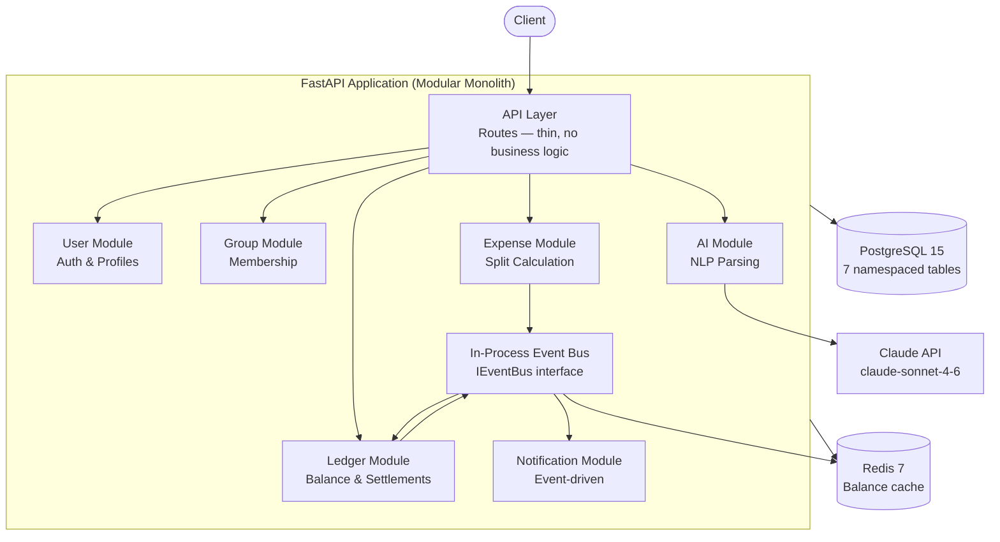

# Splitwise Clone

> **A portfolio-grade expense splitting application — modular monolith, microservice-ready.**  
> Built with Python · FastAPI · PostgreSQL · Redis · Claude AI

---

## What Is This?

A Splitwise-style app where groups of people can track shared expenses and calculate who owes whom. Built as a learning and portfolio project demonstrating:

- **Modular monolith architecture** — clean module boundaries, designed for microservice extraction
- **Design patterns** — Strategy (split algorithms), Observer (notifications), Facade (module interfaces)
- **Event-driven design** — modules communicate via an event bus, not direct calls
- **AI feature** — natural language expense parsing via Claude API (Prompt 4)
- **Production-ready foundations** — Docker, CI/CD, Alembic migrations, Redis caching

---

## Architecture (High Level)



---

## Quick Start

### Prerequisites
- Docker & Docker Compose
- Python 3.11+ (for local dev without Docker)

### With Docker (Recommended)

```bash
# 1. Clone and enter the project
git clone <repo> splitwise && cd splitwise

# 2. Set up environment variables
cp .env.example .env
# Edit .env — at minimum set CLAUDE_API_KEY for Prompt 4 features

# 3. Start all services
docker-compose up --build

# 4. Run database migrations
docker-compose exec app alembic upgrade head

# 5. Verify everything is running
curl http://localhost:8000/healthz
# → {"status": "ok", "services": {"database": "ok", "redis": "ok"}}

# 6. Open API docs
open http://localhost:8000/docs
```

### Local Development (Without Docker)

```bash
# Create and activate a virtual environment
python -m venv .venv
source .venv/bin/activate        # Linux/Mac
.venv\Scripts\activate           # Windows

# Install all dependencies (including dev)
pip install -e ".[dev]"

# Start Postgres and Redis (still need Docker for infra)
docker-compose up postgres redis -d

# Copy and configure .env
cp .env.example .env

# Run migrations
alembic upgrade head

# Start the dev server with hot-reload
uvicorn api.app:app --reload --port 8000
```

### Run Tests

```bash
pytest                         # all tests
pytest tests/unit/             # unit tests only
pytest tests/integration/      # integration tests only
pytest -v --tb=short           # verbose output
```

### Lint and Typecheck

```bash
ruff check .                   # lint
ruff format .                  # format
mypy modules shared api        # type check
```

---

## Environment Variables

| Variable | Required | Description |
|---|---|---|
| `DATABASE_URL` | Yes | Postgres async URL (`postgresql+asyncpg://...`) |
| `REDIS_URL` | Yes | Redis URL (`redis://localhost:6379/0`) |
| `JWT_SECRET` | Yes | Secret for JWT signing — generate with `python -c "import secrets; print(secrets.token_hex(32))"` |
| `CLAUDE_API_KEY` | Prompt 4 | Anthropic API key for NLP expense parsing |
| `CLAUDE_MODEL` | No | Default: `claude-sonnet-4-6` |
| `ENVIRONMENT` | No | `development` / `production` / `test` |

---

## API Endpoints

All endpoints documented at `http://localhost:8000/docs` (Swagger UI).

| Method | Path | Description | Status |
|---|---|---|---|
| GET | `/healthz` | Infrastructure health check | ✅ Done |
| POST | `/users/` | Register user | 🔲 Prompt 2 |
| GET | `/users/:id/balances` | User's total balances | 🔲 Prompt 3 |
| POST | `/groups/` | Create group | 🔲 Prompt 2 |
| POST | `/groups/:id/members` | Add member | 🔲 Prompt 2 |
| POST | `/groups/:id/expenses` | Create expense | 🔲 Prompt 2 |
| GET | `/groups/:id/balances` | Group balances (cached) | 🔲 Prompt 3 |
| GET | `/groups/:id/balances/simplified` | Minimum settlement plan | 🔲 Prompt 2 |
| POST | `/groups/:id/settle` | Record settlement | 🔲 Prompt 2 |
| POST | `/groups/:id/expenses/parse` | NLP expense parsing | 🔲 Prompt 4 |

---

## Design Decisions Summary

Full detail in [`docs/design-decisions.md`](docs/design-decisions.md).

| Decision | Choice | Why |
|---|---|---|
| Architecture | Modular monolith | Microservice complexity without microservice scale is waste |
| Language | Python + FastAPI | Async-native, Pydantic domain models, Claude SDK first-class |
| Money type | `DECIMAL(19, 4)` | Exact arithmetic — float is wrong for money |
| Split algorithm | Strategy pattern | Open/Closed: adding a new split type = one new class |
| Notifications | Observer + event bus | Decoupled from expense creation — failures don't block responses |
| Balance cache | Write-invalidate | Staleness on money data = wrong balance shown; invalidation is safer |
| AI output | Preview only | Never auto-commit ambiguous financial data |
| Debt simplification | Greedy net-flow | O(N log N), minimum transactions, well-known interview algorithm |

---

## Project Status

This project is built across 5 prompts (Antigravity-powered development):

- [x] **Prompt 1** — Scaffolding & Architecture *(this state)*
- [ ] **Prompt 2** — LLD: Domain classes, split strategies, ledger, tests
- [ ] **Prompt 3** — HLD: Full API, DB migrations, Redis caching
- [ ] **Prompt 4** — AI: Claude NLP parsing
- [ ] **Prompt 5** — Polish, diagrams, interview prep

---

## Documentation

- [`docs/architecture.md`](docs/architecture.md) — Module map, sequence diagrams, DB schema
- [`docs/design-decisions.md`](docs/design-decisions.md) — Every significant technical choice and why
- [`docs/scaling.md`](docs/scaling.md) — How this handles 10M users *(Prompt 5)*
- [`docs/interview-prep.md`](docs/interview-prep.md) — 5 hard questions + answers *(Prompt 5)*
