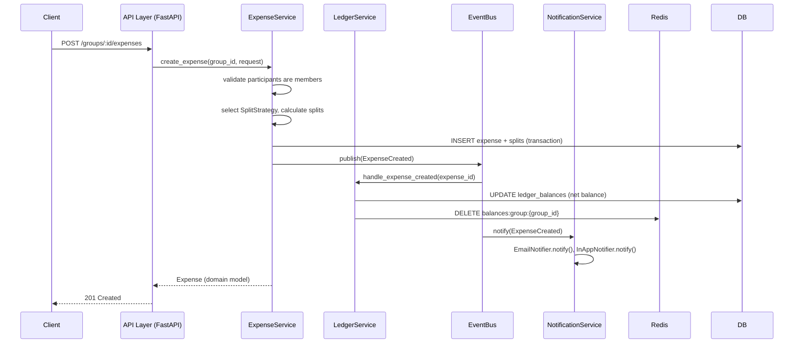
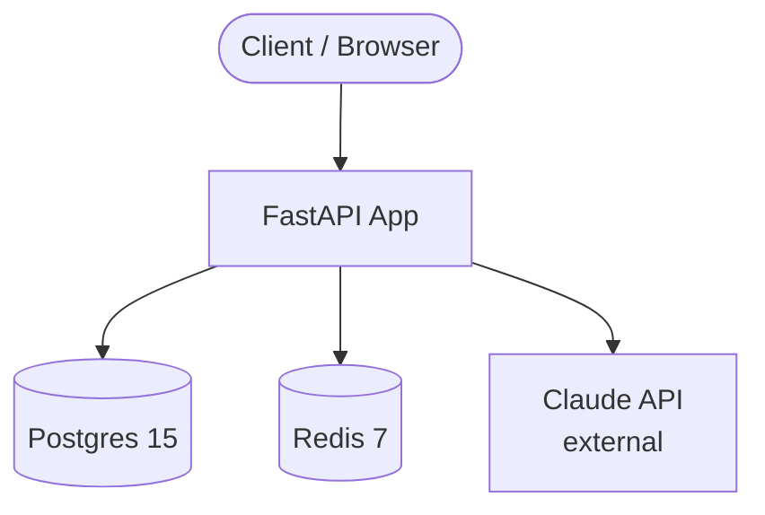
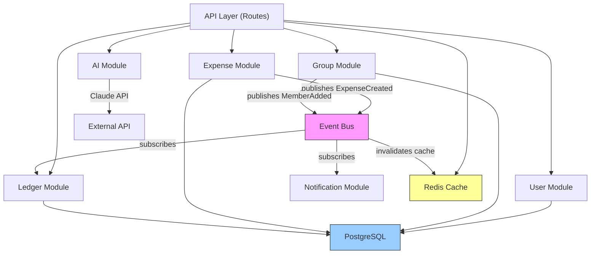
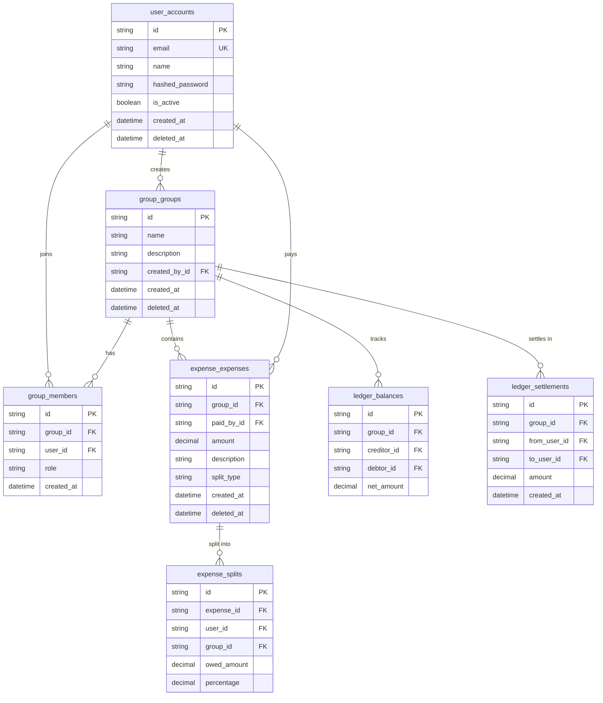
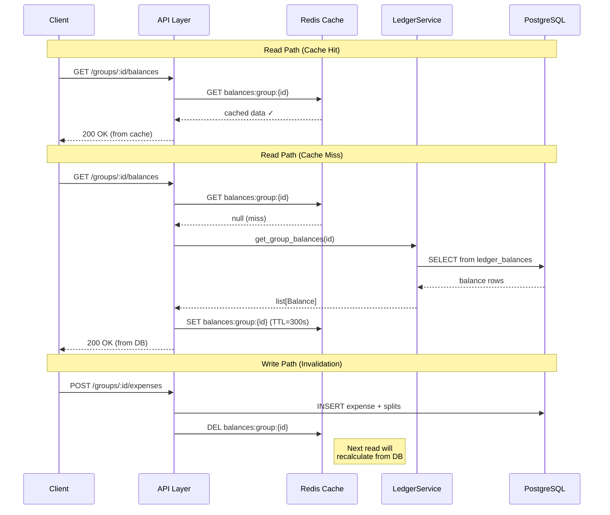

# Architecture — Splitwise Clone

## Overview

This project is a **modular monolith** — a single deployable application internally structured as independent modules with clean boundaries, explicitly designed to be split into microservices without a rewrite.

This is the standard engineering progression at most companies:
1. Start monolith (fast iteration, simple ops)
2. Identify pain points under load (which part scales differently?)
3. Extract the bottleneck module into a service, keeping the interface

This project is at stage 1, with stage 3 already designed.

---

## Module Map

```
/splitwise
├── modules/
│   ├── user/          → Authentication & profiles
│   ├── group/         → Groups & membership
│   ├── expense/       → Expense creation & split calculation
│   ├── ledger/        → Balance calculation & settlements
│   ├── ai/            → NLP expense parsing (Claude API)
│   └── notification/  → Email & in-app notifications (event-driven)
├── shared/
│   ├── events/        → Event bus abstraction
│   ├── db/            → DB engine, session, migrations
│   └── errors/        → Domain error hierarchy
└── api/               → FastAPI routes (thin — no business logic)
```

---

## Module Boundary Rules

**Rule 1: No direct cross-module imports.**
`modules/expense` must never import from `modules/ledger`.
Allowed: `expense` publishes `ExpenseCreated`. `ledger` subscribes to it.

**Rule 2: Only import from a module's `__init__.py` (the facade).**
`from modules.user import User` ✅
`from modules.user.models import UserORM` ❌ — ORM models are private.

**Rule 3: The API layer calls module facades, never module internals.**
Routes import `IUserService`, not `UserRepository`.

These three rules are what makes the "could become microservices" claim credible.

---

## Future Microservice Map

| Module | Future Service Name | Own DB? | Comms Pattern |
|---|---|---|---|
| `user` | `user-service` | Yes — user_accounts table | REST / gRPC |
| `group` | `group-service` | Yes — group_groups, group_members | REST |
| `expense` | `expense-service` | Yes — expense_expenses, expense_splits | REST + Kafka events |
| `ledger` | `ledger-service` | Yes — ledger_balances, ledger_settlements | REST (reads) + Kafka (writes) |
| `ai` | `ai-service` | No — stateless; calls Claude API | REST |
| `notification` | `notification-service` | Optional — notification log | Kafka consumer |

---

## Request Flow (Sequence Diagram)



---

## Infrastructure



---

## Database Schema (Namespaced Tables)

```
user_accounts           ← users
group_groups            ← groups
group_members           ← group ↔ user junction
expense_expenses        ← expense header
expense_splits          ← one row per participant per expense
ledger_balances         ← net balance per user-pair per group
ledger_settlements      ← immutable settlement records
```

All monetary columns: `DECIMAL(19, 4)` — exact arithmetic, no float errors.

---

## Key Indexes and Why

| Table | Index | Rationale |
|---|---|---|
| `user_accounts` | `email` (unique) | Login lookup: O(log N) |
| `group_members` | `(group_id)` | "all members of group G" — called on every expense creation |
| `group_members` | `(user_id)` | "all groups for user U" — user dashboard |
| `expense_expenses` | `(group_id, created_at DESC)` | Paginated expense list |
| `expense_splits` | `(group_id, user_id)` | **Core ledger read** — "what does user U owe in group G?" |
| `ledger_balances` | `(group_id, creditor_id)` | Balance view query |
| `ledger_balances` | unique `(group_id, creditor_id, debtor_id)` | One row per pair — enforced at DB |

---

## Monolith-First Rationale

> "Monolith first, microservices never (unless you hit a real bottleneck)."
> — Martin Fowler

Running microservices from day 1 adds:
- Network latency between every module call
- Distributed transaction complexity (2-phase commit or saga pattern)
- Independent deployment pipelines per service
- Service discovery, load balancing, TLS between services

For a product at 0 users, none of these costs are justified.
This monolith is structured to make the extraction cost near-zero *when* (not if) it's needed.

---

## How This Scales to 10M Users

See `docs/scaling.md` — this section is intentionally brief here to keep the architecture document focused on the current design.

Short version:
1. **Read replicas** for balance queries (currently the highest-read endpoint)
2. **Redis cluster** for distributed caching
3. **Kafka** replaces the in-process event bus — one consumer group per subscriber module
4. **Sharding by group_id** — all expense and ledger data for a group lives on one shard
5. **Module extraction** — ledger-service first (independent scaling of reads vs writes)

---

## Module Dependency Graph



---

## Database ER Diagram



---

## Cache Invalidation Flow



